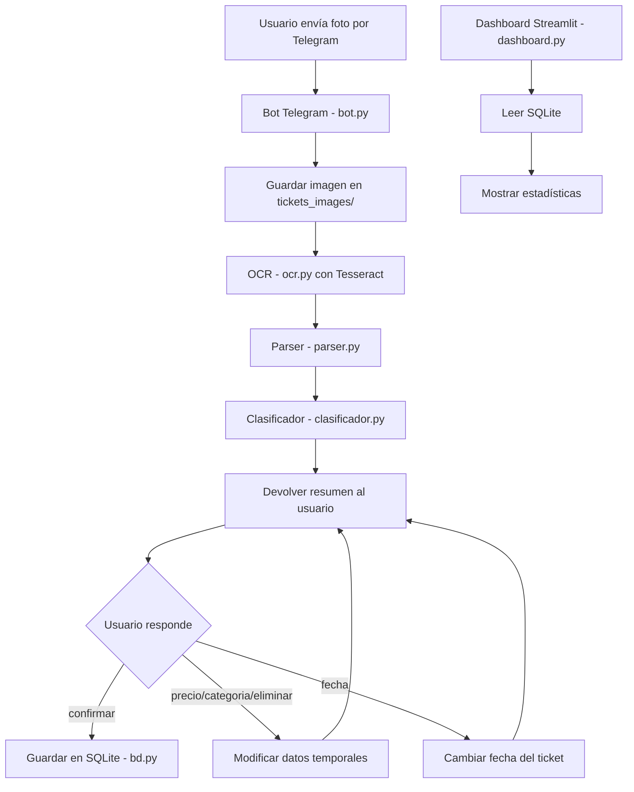
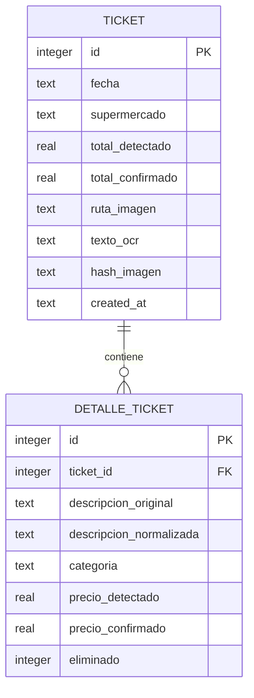
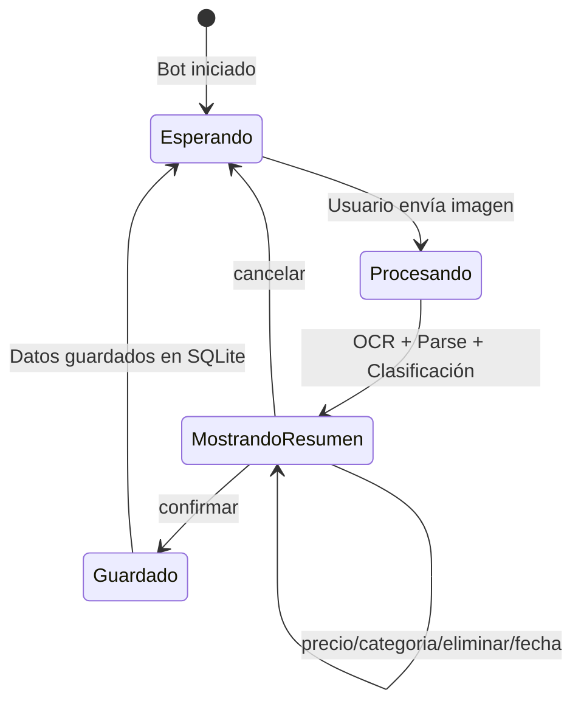

# Plan de Implementación — GastoTrack

## Resumen

Aplicación personal para registrar tickets de compra mediante Telegram, extraer datos con OCR (Tesseract), permitir corrección rápida y consultar estadísticas con Streamlit.

---

## Arquitectura



---

## Estructura del proyecto

```
project-gastotrack/
├── pyproject.toml
├── poetry.lock
├── .env
├── .env.example
├── .gitignore
├── README.md
├── plans/
│   └── plan.md
├── src/
│   └── gastotrack/
│       ├── __init__.py
│       ├── bot.py              # Bot de Telegram
│       ├── ocr.py              # Procesamiento OCR con Tesseract
│       ├── parser.py           # Parseo de líneas de ticket
│       ├── clasificador.py     # Clasificación por categoría
│       ├── bd.py               # Capa de base de datos SQLite
│       ├── modelos.py          # Dataclasses para Ticket y Detalle
│       ├── config.py           # Carga de .env y validación
│       └── dashboard.py        # Aplicación Streamlit
├── datos/
│   ├── categorias.json         # Diccionario de clasificación
│   └── gastotrack.db           # Base de datos SQLite (generada)
├── tickets_images/             # Imágenes originales de tickets
└── tests/
    ├── __init__.py
    ├── test_parser.py
    ├── test_clasificador.py
    └── test_bd.py
```

### Decisiones sobre la estructura

- **`src/gastotrack/`**: Paquete Python estándar que facilita imports limpios y testing.
- **`datos/`**: Separa datos persistentes (BD, categorías) del código fuente.
- **`modelos.py`**: Dataclasses para representar Ticket y DetalleTicket, evitando diccionarios sueltos.
- **`config.py`**: Centraliza carga de `.env` y falla explícitamente si falta configuración.

---

## Modelo de datos



### Notas sobre el modelo

- `hash_imagen`: SHA-256 de la imagen para detectar duplicados.
- `eliminado`: Borrado lógico (0/1), nunca se eliminan registros físicamente.
- `total_detectado` vs `total_confirmado`: Trazabilidad de correcciones.
- `precio_detectado` vs `precio_confirmado`: Igual para líneas de detalle.

---

## Dependencias principales

| Librería | Uso |
|---|---|
| `python-telegram-bot` | API de Telegram |
| `pytesseract` | Wrapper Python para Tesseract OCR |
| `Pillow` | Manipulación de imágenes |
| `streamlit` | Dashboard de estadísticas |
| `plotly` | Gráficos interactivos para el dashboard |
| `python-dotenv` | Carga de variables de entorno |
| `pytest` | Testing |

### Dependencias del sistema

- **Tesseract OCR** + datos de idioma español (`tesseract-ocr-spa`)

---

## Flujo de interacción por Telegram



### Formato del resumen enviado al usuario

```
🧾 Ticket detectado
📅 Fecha: 2026-02-18
🏪 Supermercado: MERCADONA

1. PECH POLLO — Carne — 8.90€
2. MERLUZA FILETE — Pescado — 5.20€
3. LECHE ENTERA — Lácteos — 2.10€

💰 Total detectado: 16.20€

Comandos:
• confirmar
• precio <n> <nuevo_precio>
• categoria <n> <nueva_categoria>
• eliminar <n>
• fecha <YYYY-MM-DD>
• cancelar
```

### Estado en memoria

El bot mantiene un diccionario en memoria `sesiones_activas` con el `chat_id` como clave. Cada sesión contiene los datos temporales del ticket en proceso. Al confirmar, se persiste en SQLite y se limpia la sesión.

---

## Pasos de implementación

### Paso 1 — Configuración del proyecto

- Inicializar proyecto con Poetry y Python 3.12.
- Crear `pyproject.toml` con todas las dependencias.
- Crear `.gitignore`, `.env.example`, `README.md`.
- Crear estructura de directorios.
- Configurar `poetry config virtualenvs.in-project true`.

### Paso 2 — Configuración y modelos

- Implementar `config.py`: carga de `.env`, validación estricta de variables requeridas.
- Implementar `modelos.py`: dataclasses `Ticket` y `DetalleTicket`.

### Paso 3 — Base de datos

- Implementar `bd.py` con SQLite.
- Funciones: crear tablas, insertar ticket con detalles, consultar tickets, detectar duplicados por hash.
- Migración automática al inicio (crear tablas si no existen).

### Paso 4 — OCR

- Implementar `ocr.py`.
- Funciones: preprocesar imagen (escala de grises, contraste), ejecutar Tesseract, devolver texto crudo.
- Manejar errores de Tesseract explícitamente.

### Paso 5 — Parser de tickets

- Implementar `parser.py`.
- Funciones: extraer líneas de productos con precios, detectar total, detectar fecha, detectar supermercado.
- Manejar casos edge: líneas partidas, IVA separado, formatos de precio variados.
- Usar regex para detectar patrones de precio como `8,90`, `8.90`, `8,90€`.

### Paso 6 — Clasificador

- Implementar `clasificador.py`.
- Cargar `categorias.json` (formato: categoría → lista de palabras clave).
- Normalizar texto (minúsculas, eliminar números, acentos).
- Para clasificar: recorrer cada categoría y sus palabras clave, buscar match parcial en la descripción.
- Categoría por defecto: "otros".
- Al corregir: añadir la palabra clave normalizada a la categoría corregida en el JSON.

### Paso 7 — Bot de Telegram

- Implementar `bot.py`.
- Handlers: imagen recibida, comandos de texto (confirmar, precio, categoria, eliminar, fecha, cancelar).
- Gestión de sesiones en memoria.
- Flujo completo de procesamiento de ticket.

### Paso 8 — Dashboard Streamlit

- Implementar `dashboard.py`.
- Vista 1: Gasto total, media mensual, último mes vs media.
- Vista 2: Evolución mensual (línea), filtro por categoría.
- Vista 3: Distribución por categoría y supermercado (barras).

### Paso 9 — Tests

- Tests para `parser.py`: parseo de líneas, detección de precios, casos edge.
- Tests para `clasificador.py`: clasificación correcta, normalización, categoría por defecto.
- Tests para `bd.py`: inserción, consulta, detección de duplicados.

### Paso 10 — Documentación

- README.md con instrucciones de instalación, configuración y uso.
- Incluir instrucciones de instalación de Tesseract.

---

## Categorías iniciales

El archivo `categorias.json` usa la estructura **categoría → lista de palabras clave**:

```json
{
  "carne": [
    "pollo", "ternera", "cerdo", "jamon", "chorizo", "salchich",
    "costilla", "lomo", "filete", "hamburguesa", "bistec"
  ],
  "pescado": [
    "merluza", "salmon", "atun", "gamba", "bacalao", "sardina",
    "calamar", "mejillon", "pescadilla"
  ],
  "lacteos": [
    "leche", "yogur", "queso", "mantequilla", "nata", "crema",
    "requeson", "flan", "batido"
  ],
  "panaderia": [
    "pan", "barra", "baguette", "bolleria", "croissant",
    "pan integral", "pan de molde"
  ],
  "bebidas": [
    "agua", "cerveza", "vino", "refresco", "coca", "fanta",
    "sprite", "zumo", "cafe", "te", "infusion"
  ],
  "verduras": [
    "tomate", "lechuga", "cebolla", "patata", "zanahoria",
    "pepino", "pimiento", "calabacin", "berenjena", "espinaca",
    "brocoli"
  ],
  "frutas": [
    "manzana", "platano", "naranja", "fresa", "pera", "kiwi",
    "melon", "sandia", "limon", "mandarina", "ciruela"
  ],
  "hogar": [
    "papel", "detergente", "jabon", "suavizante", "servilleta",
    "esponja", "trapo", "bolsa basura", "limpiador"
  ]
}
```

### Lógica de clasificación

1. Normalizar la descripción del producto (minúsculas, sin acentos, sin números).
2. Para cada categoría, recorrer su lista de palabras clave.
3. Si alguna palabra clave está contenida en la descripción normalizada → asignar esa categoría.
4. Si no hay match → asignar "otros".
5. Si el usuario corrige la categoría de un producto, extraer la palabra clave más representativa de la descripción y añadirla a la lista de la nueva categoría.

---

## Detección de duplicados

Estrategia combinada:

1. **Hash SHA-256 de la imagen**: Detecta envío exacto de la misma foto.
2. **Combinación fecha + total + supermercado**: Detecta tickets del mismo momento aunque la foto sea diferente (ej. reenvío desde galería).

Al detectar duplicado, el bot informa al usuario y pide confirmación explícita antes de guardar.

---

## Estrategia de parseo de tickets

El parser seguirá estas reglas:

1. Dividir texto OCR en líneas.
2. Para cada línea, buscar patrón de precio al final: `\d+[.,]\d{2}\s*€?$`.
3. La parte antes del precio es la descripción del producto.
4. Descartar líneas que contengan palabras clave de no-producto: `total`, `iva`, `subtotal`, `cambio`, `tarjeta`, `efectivo`, `dto`, `descuento`.
5. Detectar total buscando línea con `total` seguido de precio.
6. Detectar supermercado buscando patrones conocidos en las primeras líneas.
7. Detectar fecha buscando patrones `DD/MM/YYYY` o `DD-MM-YYYY`.

---

## Notas técnicas adicionales

- **Sin concurrencia**: No se necesitan locks ni manejo de transacciones complejas. SQLite en modo WAL es suficiente.
- **Imágenes**: Se guardan con nombre basado en timestamp + hash corto para evitar colisiones.
- **Sesiones del bot**: Diccionario simple en memoria. Si el bot se reinicia, las sesiones pendientes se pierden (aceptable para uso personal).
- **Streamlit**: Se ejecuta manualmente con `poetry run streamlit run src/gastotrack/dashboard.py`.
- **Bot**: Se ejecuta con `poetry run python -m gastotrack.bot`.
