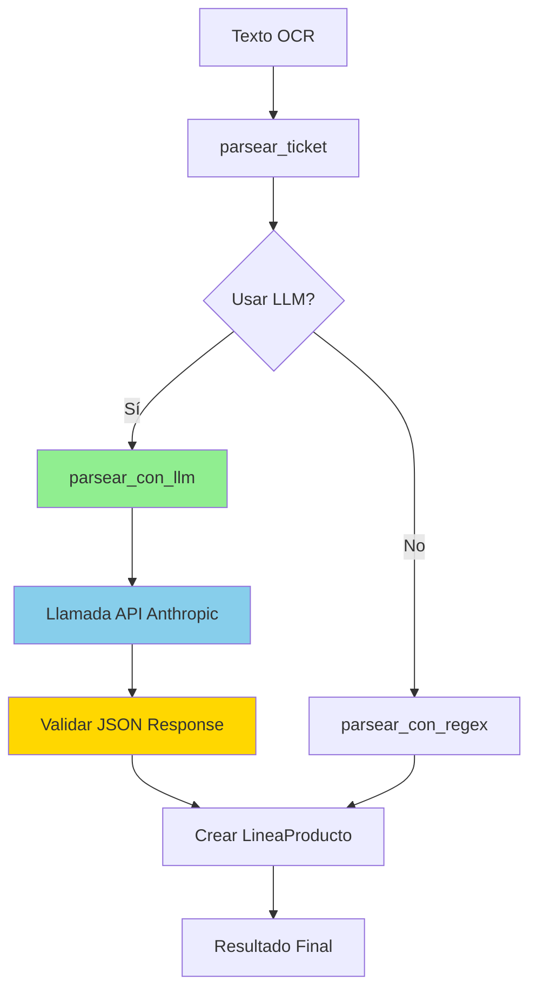

# Plan de Refactor: Parser con LLM de Anthropic

## 1. Análisis del Problema Actual

### Comportamiento Actual
El parser actual usa expresiones regulares y lógica basada en patrones para extraer información de tickets. Esto funciona bien para casos simples, pero falla en casos complejos como:

#### Ejemplo Problemático 1: Productos con Peso
```
CALABACÍN
1,200-kg x0.2,45 €/ko G 29€
```
**Problema**: El parser actual no detecta este producto porque la descripción está en una línea separada del precio.

#### Ejemplo Problemático 2: Productos con Peso y Precio Unitario
```
PLATANO CANARIO BOLSA
0,675 kg x 2,29 €/kg € 1,55 €
```
**Problema**: Similar al anterior, la descripción está separada del precio final.

#### Resultado Actual (Incorrecto)
```
1. 0,675 kg x 2,29 €/kg €                     1.55€
2. CHAMPÚ FRUCTIS 360ML FUERZA B              4.55€
```

#### Resultado Esperado (Correcto)
```
1. CALABACÍN (1,200 kg x 0,245 €/kg)          0.29€
2. PLATANO CANARIO BOLSA (0,675 kg x 2,29 €/kg) 1.55€
3. CHAMPÚ FRUCTIS 360ML FUERZA B              4.55€
```

### Limitaciones del Enfoque Actual
1. **Líneas multi-línea**: No puede asociar descripciones que están en líneas separadas de sus precios
2. **Contexto limitado**: No entiende el contexto del ticket (productos con peso vs productos normales)
3. **Patrones rígidos**: Requiere patrones regex específicos para cada formato de ticket
4. **Mantenimiento**: Cada nuevo formato de ticket requiere nuevos patrones

## 2. Solución Propuesta: Parser con LLM

### Ventajas del Enfoque con LLM
1. **Comprensión contextual**: Entiende el contexto completo del ticket
2. **Flexibilidad**: Maneja múltiples formatos sin cambios de código
3. **Productos multi-línea**: Puede asociar descripciones con precios aunque estén separados
4. **Extracción inteligente**: Identifica peso, precio unitario y precio total automáticamente
5. **Mantenibilidad**: Un solo prompt en lugar de múltiples patrones regex

### Modelo Seleccionado
**Claude Haiku 3.5** (`claude-3-5-haiku-20241022`)
- Modelo más ligero y económico de Anthropic
- Excelente para tareas de extracción estructurada
- Bajo costo por token (~$0.25 por millón de tokens de entrada)
- Latencia baja (~1-2 segundos por ticket)

## 3. Diseño de la Solución

### 3.1. Estructura del Prompt

```
Eres un experto en parsear tickets de supermercado en español.

Tu tarea es extraer información estructurada del siguiente texto OCR de un ticket.

INSTRUCCIONES:
1. Identifica TODOS los productos comprados, incluyendo aquellos cuya descripción está en una línea separada del precio
2. Para productos con peso (kg), extrae:
   - Descripción del producto
   - Cantidad en kg
   - Precio por kg
   - Precio total
3. Para productos normales, extrae:
   - Descripción del producto
   - Precio total
4. Ignora líneas que sean:
   - Totales, subtotales, IVA
   - Información del establecimiento
   - Métodos de pago
5. Extrae también:
   - Fecha del ticket (formato YYYY-MM-DD)
   - Nombre del supermercado
   - Total del ticket

FORMATO DE SALIDA:
Responde ÚNICAMENTE con un objeto JSON válido con esta estructura:
{
  "supermercado": "NOMBRE_SUPERMERCADO",
  "fecha": "YYYY-MM-DD",
  "total": 35.19,
  "productos": [
    {
      "descripcion": "CALABACÍN",
      "cantidad_kg": 1.200,
      "precio_por_kg": 0.245,
      "precio": 0.29
    },
    {
      "descripcion": "CHAMPÚ FRUCTIS 360ML FUERZA B",
      "precio": 4.55
    }
  ]
}

TEXTO OCR:
{texto_ocr}
```

### 3.2. Estructura de Datos

#### Clase LineaProducto (Actualizada)
```python
class LineaProducto:
    def __init__(
        self,
        descripcion: str,
        precio: float,
        cantidad_kg: Optional[float] = None,
        precio_por_kg: Optional[float] = None
    ):
        self.descripcion = descripcion.strip()
        self.precio = precio
        self.cantidad_kg = cantidad_kg
        self.precio_por_kg = precio_por_kg
    
    def __repr__(self):
        if self.cantidad_kg and self.precio_por_kg:
            return (
                f"LineaProducto(descripcion='{self.descripcion}', "
                f"cantidad_kg={self.cantidad_kg}, "
                f"precio_por_kg={self.precio_por_kg}, "
                f"precio={self.precio})"
            )
        return f"LineaProducto(descripcion='{self.descripcion}', precio={self.precio})"
```

### 3.3. Arquitectura del Nuevo Parser



### 3.4. Manejo de Errores y Fallback

El nuevo parser incluirá:
1. **Validación de respuesta**: Verificar que el JSON sea válido
2. **Fallback a regex**: Si el LLM falla, usar el parser antiguo
3. **Retry logic**: Reintentar hasta 2 veces en caso de error de API
4. **Logging**: Registrar errores para debugging

## 4. Cambios Necesarios

### 4.1. Dependencias (pyproject.toml)
```toml
dependencies = [
    "python-telegram-bot (>=22.6,<23.0)",
    "pytesseract (>=0.3.13,<0.4.0)",
    "pillow (>=12.1.1,<13.0.0)",
    "streamlit (>=1.54.0,<2.0.0)",
    "plotly (>=6.5.2,<7.0.0)",
    "python-dotenv (>=1.2.1,<2.0.0)",
    "anthropic (>=0.40.0,<1.0.0)"  # NUEVO
]
```

### 4.2. Variables de Entorno (.env.example)
```bash
# Token del bot de Telegram
TELEGRAM_TOKEN=tu_token_aqui

# API Key de Anthropic para parser con LLM
ANTHROPIC_API_KEY=tu_api_key_aqui

# Idioma para Tesseract OCR
OCR_LANGUAGE=spa

# Configuración del parser
PARSER_USE_LLM=true  # true para usar LLM, false para usar regex
PARSER_LLM_MODEL=claude-3-5-haiku-20241022

# Rutas
DB_PATH=datos/gastotrack.db
IMAGES_DIR=tickets_images
CATEGORIES_FILE=datos/categorias.json
```

### 4.3. Configuración (config.py)
```python
class Config:
    # ... configuración existente ...
    
    # Configuración de Anthropic
    ANTHROPIC_API_KEY: str = os.getenv("ANTHROPIC_API_KEY", "")
    
    # Configuración del parser
    PARSER_USE_LLM: bool = os.getenv("PARSER_USE_LLM", "true").lower() == "true"
    PARSER_LLM_MODEL: str = os.getenv("PARSER_LLM_MODEL", "claude-3-5-haiku-20241022")
```

### 4.4. Parser (parser.py)

#### Funciones Principales
1. `parsear_con_llm(texto_ocr: str) -> dict`: Nueva función principal con LLM
2. `parsear_con_regex(texto_ocr: str) -> dict`: Renombrar `parsear_ticket` actual
3. `parsear_ticket(texto_ocr: str) -> dict`: Función wrapper que decide qué método usar
4. `validar_respuesta_llm(respuesta: dict) -> bool`: Validar estructura JSON
5. `crear_prompt_parseo(texto_ocr: str) -> str`: Generar prompt para el LLM

#### Estructura del Código
```python
import anthropic
from gastotrack.config import Config

def parsear_con_llm(texto_ocr: str, max_retries: int = 2) -> dict:
    """Parsea el ticket usando Claude Haiku 3.5"""
    client = anthropic.Anthropic(api_key=Config.ANTHROPIC_API_KEY)
    
    prompt = crear_prompt_parseo(texto_ocr)
    
    for intento in range(max_retries):
        try:
            message = client.messages.create(
                model=Config.PARSER_LLM_MODEL,
                max_tokens=2000,
                messages=[{"role": "user", "content": prompt}]
            )
            
            respuesta_json = json.loads(message.content[0].text)
            
            if validar_respuesta_llm(respuesta_json):
                return convertir_respuesta_llm(respuesta_json)
            
        except Exception as e:
            if intento == max_retries - 1:
                # Fallback a regex
                return parsear_con_regex(texto_ocr)
    
    return parsear_con_regex(texto_ocr)
```

### 4.5. Tests Unitarios (test_parser.py)

#### Tests Nuevos
1. `test_parsear_con_llm_producto_con_peso()`: Probar productos con peso
2. `test_parsear_con_llm_producto_normal()`: Probar productos normales
3. `test_parsear_con_llm_ticket_completo()`: Probar ticket completo
4. `test_fallback_a_regex()`: Probar fallback cuando LLM falla
5. `test_validar_respuesta_llm()`: Probar validación de respuesta

#### Mocking
Usar `unittest.mock` para mockear las llamadas a la API de Anthropic:
```python
from unittest.mock import patch, MagicMock

@patch('anthropic.Anthropic')
def test_parsear_con_llm_producto_con_peso(mock_anthropic):
    # Mock de la respuesta de la API
    mock_client = MagicMock()
    mock_anthropic.return_value = mock_client
    
    mock_response = MagicMock()
    mock_response.content = [MagicMock(text='{"supermercado": "AHORRAMAS", ...}')]
    mock_client.messages.create.return_value = mock_response
    
    # Test
    resultado = parsear_con_llm(texto_ocr_ejemplo)
    assert len(resultado['productos']) == 2
```

### 4.6. Test Manual (test_manual.py)

Actualizar para mostrar información adicional de productos con peso:
```python
def probar_parser(texto_ocr: str):
    """Prueba el módulo parser."""
    imprimir_separador("2. PRUEBA DE PARSER")
    
    resultado = parsear_ticket(texto_ocr)
    
    print(f"📅 Fecha detectada: {resultado['fecha']}")
    print(f"🏪 Supermercado: {resultado['supermercado']}")
    print(f"💰 Total detectado: {resultado['total']:.2f}€")
    print(f"📦 Productos encontrados: {len(resultado['productos'])}\n")
    
    if resultado['productos']:
        print("--- PRODUCTOS ---")
        for i, producto in enumerate(resultado['productos'], 1):
            if producto.cantidad_kg and producto.precio_por_kg:
                print(f"{i}. {producto.descripcion:40s}")
                print(f"   ({producto.cantidad_kg:.3f} kg x {producto.precio_por_kg:.2f} €/kg) = {producto.precio:6.2f}€")
            else:
                print(f"{i}. {producto.descripcion:40s} {producto.precio:6.2f}€")
        print("--- FIN PRODUCTOS ---")
```

## 5. Estimación de Costos

### Costos de API de Anthropic (Claude Haiku 3.5)
- **Input**: ~$0.25 por millón de tokens
- **Output**: ~$1.25 por millón de tokens

### Estimación por Ticket
- Texto OCR promedio: ~500 tokens
- Respuesta JSON: ~200 tokens
- **Costo por ticket**: ~$0.00038 (menos de medio centavo)

### Comparación
- **100 tickets/mes**: ~$0.04
- **1000 tickets/mes**: ~$0.38
- **10000 tickets/mes**: ~$3.80

**Conclusión**: El costo es insignificante para uso personal.

## 6. Ventajas y Desventajas

### Ventajas
✅ Maneja productos multi-línea correctamente
✅ Extrae información de peso y precio unitario
✅ Más flexible ante variaciones de formato
✅ Menos código de mantenimiento
✅ Mejor precisión en casos complejos
✅ Costo muy bajo para uso personal

### Desventajas
❌ Requiere conexión a internet
❌ Dependencia externa (API de Anthropic)
❌ Latencia adicional (~1-2 segundos)
❌ Costo variable (aunque mínimo)

### Mitigación de Desventajas
- Mantener parser regex como fallback
- Implementar caché local para tickets ya procesados
- Configuración para activar/desactivar LLM

## 7. Plan de Implementación

### Fase 1: Preparación
- [x] Analizar problema actual
- [x] Diseñar solución con LLM
- [ ] Actualizar dependencias
- [ ] Configurar variables de entorno

### Fase 2: Implementación Core
- [ ] Refactorizar parser.py
- [ ] Implementar parsear_con_llm()
- [ ] Implementar validación y fallback
- [ ] Actualizar LineaProducto

### Fase 3: Testing
- [ ] Actualizar tests unitarios
- [ ] Crear tests de integración
- [ ] Actualizar test_manual.py
- [ ] Probar con tickets reales

### Fase 4: Documentación
- [ ] Actualizar README.md
- [ ] Documentar configuración
- [ ] Documentar costos y limitaciones

## 8. Casos de Prueba

### Caso 1: Producto con Peso (Multi-línea)
```
Input:
CALABACÍN
1,200-kg x0.2,45 €/ko G 29€

Expected Output:
{
  "descripcion": "CALABACÍN",
  "cantidad_kg": 1.200,
  "precio_por_kg": 0.245,
  "precio": 0.29
}
```

### Caso 2: Producto Normal
```
Input:
CHAMPÚ FRUCTIS 360ML FUERZA B 4,55 €

Expected Output:
{
  "descripcion": "CHAMPÚ FRUCTIS 360ML FUERZA B",
  "precio": 4.55
}
```

### Caso 3: Ticket Completo (Ahorramas)
```
Input: [Texto OCR del ejemplo proporcionado]

Expected Output:
- 11 productos correctamente identificados
- Productos con peso correctamente parseados
- Total: 35.19€
- Fecha: 2026-02-10
- Supermercado: AHORRAMAS
```

## 9. Próximos Pasos

1. **Obtener API Key de Anthropic**: Registrarse en https://console.anthropic.com/
2. **Implementar cambios**: Seguir el plan de implementación
3. **Probar exhaustivamente**: Usar test_manual.py con tickets reales
4. **Ajustar prompt**: Iterar sobre el prompt según resultados
5. **Documentar**: Actualizar documentación del proyecto

## 10. Consideraciones Futuras

### Optimizaciones Posibles
1. **Caché de resultados**: Guardar parseos exitosos para evitar reprocesar
2. **Batch processing**: Procesar múltiples tickets en una sola llamada
3. **Fine-tuning**: Entrenar modelo específico si el volumen lo justifica
4. **Prompt engineering**: Mejorar prompt con ejemplos few-shot

### Extensiones
1. **Soporte multi-idioma**: Adaptar prompt para otros idiomas
2. **Detección de errores OCR**: Que el LLM corrija errores comunes de OCR
3. **Extracción de descuentos**: Identificar promociones y descuentos
4. **Análisis de categorías**: Integrar clasificación en el mismo paso
